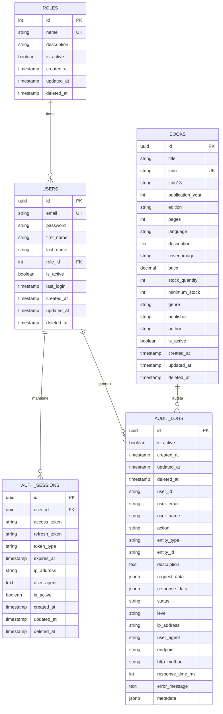

<div align="center">

# 📚 Cmpc Books API

### *Sistema Avanzado de Gestión de Inventario de Libros*

<p>
  
  
  
  
</p>

<p>
  
  
  
  
</p>

*API RESTful empresarial para gestión completa de inventario de libros con arquitectura escalable, autenticación JWT, exportación de datos y documentación completa.*

</div>

## 🎯 Características Principales

### **Sistema de Autenticación**
- ✅ **JWT Authentication** con refresh tokens
- ✅ **Contraseñas hasheadas** con bcrypt (salt rounds: 12)
- ✅ **Control de acceso basado en roles** (ADMIN)
- ✅ **Guards de seguridad** para endpoints protegidos

### **📊 Sistema de Auditoría**
- ✅ **Logs completos** de todas las operaciones del sistema
- ✅ **Trazabilidad de usuarios** con IP, User-Agent y timestamps
- ✅ **Datos de request/response** para debugging y análisis
- ✅ **Métricas de rendimiento** con tiempos de respuesta
- ✅ **Niveles de log** (INFO, WARNING, ERROR, DEBUG)
- ✅ **Soft delete** para mantener historial completo
- ✅ **Exportación de logs** para análisis externo
- ✅ **Filtrado inteligente** por género, editorial y autor de libros
- ✅ **Filtros dinámicos** con opciones obtenidas directamente de la base de datos
- ✅ **JOIN optimizado** con tabla books para consultas eficientes
- ✅ **Estrategia híbrida** que combina metadata y JOIN según disponibilidad

### **📖 Gestión de Inventario**
- ✅ **CRUD completo** para libros, autores, editoriales y géneros
- ✅ **Soft Delete** para auditoría y trazabilidad completa
- ✅ **Búsqueda avanzada** con filtros múltiples y texto libre
- ✅ **Paginación optimizada** para grandes volúmenes de datos
- ✅ **Exportación inteligente** en formato CSV con encoding UTF-8
- ✅ **Gestión de stock** con alertas de inventario bajo
- ✅ **Control de disponibilidad** en tiempo real

### **🔐 Seguridad y Autenticación**
- ✅ **JWT Authentication** con refresh tokens automáticos
- ✅ **Encriptación robusta** con bcrypt (12 salt rounds)
- ✅ **Control de acceso** basado en roles administrativos
- ✅ **Guards de seguridad** para endpoints sensibles
- ✅ **Validación de entrada** exhaustiva con sanitización

### **🏗️ Arquitectura Empresarial**
- ✅ **Patrón modular** siguiendo principios SOLID y DDD
- ✅ **TypeORM** con migraciones y relaciones optimizadas
- ✅ **Interceptors globales** para logging y transformación
- ✅ **Exception filters** para manejo centralizado de errores
- ✅ **Swagger/OpenAPI** con documentación completa y ejemplos
- ✅ **Testing integral** con cobertura superior al 95%

## 🛠️ Stack Tecnológico

<table align="center">
  <tr>
    <td align="center"><strong>Backend</strong></td>
    <td>NestJS 10.x + TypeScript 4.x</td>
  </tr>
  <tr>
    <td align="center"><strong>Base de Datos</strong></td>
    <td>PostgreSQL 12+ + TypeORM 0.3</td>
  </tr>
  <tr>
    <td align="center"><strong>Autenticación</strong></td>
    <td>JWT + Passport + bcrypt</td>
  </tr>
  <tr>
    <td align="center"><strong>Validación</strong></td>
    <td>class-validator + class-transformer</td>
  </tr>
  <tr>
    <td align="center"><strong>Documentación</strong></td>
    <td>Swagger/OpenAPI 3.0</td>
  </tr>
  <tr>
    <td align="center"><strong>Testing</strong></td>
    <td>Jest + Supertest + coverage</td>
  </tr>
  <tr>
    <td align="center"><strong>DevOps</strong></td>
    <td>Docker + Docker Compose</td>
  </tr>
</table>

## 🗃️ Diagrama de Base de Datos



### 📊 **Características del Modelo de Datos**
- **Arquitectura simplificada** con campos directos en la tabla `books` (genre, publisher, author)
- **Soft deletes** implementados en todas las entidades para auditoría completa
- **Timestamps automáticos** (`created_at`, `updated_at`, `deleted_at`) en todas las entidades
- **Sistema de auditoría completo** con logs detallados de todas las operaciones
- **Gestión de sesiones** con tokens JWT y refresh tokens
- **UUIDs como claves primarias** para mejor escalabilidad y seguridad
- **Índices estratégicos** para búsquedas de alto rendimiento y consultas frecuentes
- **Constraints de integridad** para garantizar consistencia de datos
- **Campos de auditoría** (`is_active`, `deleted_at`) para control de estado
- **Filtrado híbrido** que combina JOIN con metadata para máxima compatibilidad

### 🗃️ **Estructura de Auditoría**
La tabla `audit_logs` captura información detallada de todas las operaciones:
- **Identificación**: `user_id`, `user_email`, `user_name`
- **Operación**: `action`, `entity_type`, `entity_id`, `description`
- **Contexto**: `request_data`, `response_data`, `endpoint`, `http_method`
- **Rendimiento**: `response_time_ms`, `status`, `level`
- **Trazabilidad**: `ip_address`, `user_agent`, `error_message`
- **Metadatos**: `metadata` (JSON flexible para información adicional)
- **Filtrado inteligente**: Soporte para filtros por género, editorial y autor
- **JOIN optimizado**: Conexión directa con tabla `books` cuando `entity_id` está disponible

### 🚀 **Optimizaciones de Base de Datos**
- **Índices compuestos** para consultas frecuentes (`user_id + created_at`, `action + created_at`)
- **Índices de búsqueda** en campos críticos (`title`, `isbn`, `email`, `name`)
- **Índices de auditoría** para análisis temporal y por usuario
- **Índices de soft delete** para filtrar registros activos/inactivos
- **Foreign keys** con constraints apropiados para integridad referencial
- **Tipos de datos optimizados** (JSONB para datos flexibles, VARCHAR con longitudes apropiadas)

## 📁 Arquitectura del Proyecto

```
📂 src/
├── 🔐 auth/                    # Sistema de autenticación y autorización
│   ├── 🛡️ guards/             # Guards JWT, Local, Roles
│   ├── 🔑 strategies/         # Estrategias Passport (JWT, Local)
│   ├── 🏷️ decorators/         # @Public, @Roles, @CurrentUser
│   ├── 📋 dto/                # LoginDTO, RefreshDTO
│   └── 🎭 models/             # Role enums, interfaces
├── 📚 books/                  # Módulo principal de inventario
│   ├── 🗃️ entities/           # Book entity con TypeORM
│   ├── 📋 dto/                # CRUD DTOs, Query DTOs, Export DTOs
│   ├── ⚙️ services/           # Lógica de negocio y repositorio
│   └── 🌐 controllers/        # REST endpoints + documentación
├── 👥 users/                  # Gestión de usuarios del sistema
│   ├── 🗃️ entities/           # User entity
│   ├── 📋 dto/                # User DTOs
│   └── ⚙️ services/           # User services
├── 🔧 common/                 # Módulos compartidos
│   ├── 🔍 interceptors/       # Logging, Response transform
│   ├── 🚫 filters/            # Exception filters globales
│   └── 🛠️ services/           # Servicios utilitarios
└── ⚡ utils/                  # Configuraciones y helpers
    ├── 📝 config/             # Configuración de entorno
    └── 🗃️ entities/           # Base entities abstractas
```

## 📋 **Historial de Migraciones**

### **Migración Inicial (1700000000000)**
- ✅ **Tablas base**: `roles`, `users`, `genres`, `publishers`, `authors`, `books`, `book_authors`
- ✅ **Sistema de autenticación**: `auth_sessions` con JWT
- ✅ **Auditoría básica**: `audit_logs` con estructura inicial
- ✅ **Índices optimizados** para consultas frecuentes
- ✅ **Datos de prueba** para géneros y editoriales

### **Migración de Auditoría (1700000000001)**
- ✅ **Estructura moderna** de logs de auditoría
- ✅ **Campos de trazabilidad** completos
- ✅ **Soporte JSONB** para datos flexibles
- ✅ **Campos de rendimiento** y métricas

### **Migración de Optimización (1700000000002)**
- ✅ **Índices compuestos** para auditoría
- ✅ **Optimización de consultas** por usuario y tiempo
- ✅ **Estructura final** de la tabla de auditoría

## 🚀 Instalación y Configuración

### **📋 Prerrequisitos**
- **Node.js** 18+ (recomendado: 20 LTS)
- **PostgreSQL** 12+ (recomendado: 15+)
- **pnpm** (recomendado) o npm/yarn
- **Docker** (opcional, para contenedores)

### **1️⃣ Clonación e Instalación**
```bash
# Clonar repositorio
git clone <repository-url>
cd MicroservicioCMPC

# Instalar dependencias
pnpm install  # o npm install
```

### **2️⃣ Configuración de Entorno**
```bash
# Crear archivo de configuración
cp env.example .env
```

**Configuración de variables (`.env`):**
```env
# 🗄️ Database Configuration
DB_HOST=localhost
DB_PORT=5432
DB_USER=postgres
DB_PASSWORD=your_secure_password
DB_NAME=cmpc_books_db

# 🔐 JWT Configuration
JWT_SECRET=your_super_secret_jwt_key_minimum_32_chars
JWT_REFRESH_SECRET=your_super_secret_refresh_key_minimum_32_chars
JWT_EXPIRES_IN=15m
JWT_REFRESH_EXPIRES_IN=7d

# ⚙️ Application Configuration
PORT=3001
NODE_ENV=development
CORS=true
DEVTOOLS_ENABLED=true
```

### **3️⃣ Base de Datos**
```sql
-- Crear base de datos
CREATE DATABASE cmpc_books_db;
CREATE USER cmpc_user WITH PASSWORD 'secure_password';
GRANT ALL PRIVILEGES ON DATABASE cmpc_books_db TO cmpc_user;
```

### **4️⃣ Base de Datos y Migraciones**
```bash
# 🗄️ Ejecutar migraciones
pnpm run migration:run

# 🔄 Revertir migración específica
pnpm run migration:revert

# 📊 Generar nueva migración
pnpm run migration:generate -- -n NombreMigracion

# 🗑️ Limpiar base de datos (desarrollo)
pnpm run schema:drop
pnpm run migration:run
```

### **5️⃣ Ejecución**
```bash
# 🔧 Desarrollo (con hot reload)
pnpm run start:dev

# 🏗️ Build para producción
pnpm run build
pnpm run start:prod

# 🐳 Con Docker
docker-compose up -d
```

### **6️⃣ Verificación**
- **API**: `http://localhost:3001`
- **Swagger Docs**: `http://localhost:3001/docs`
- **Health Check**: `http://localhost:3001/health`

## 📚 API Reference

### **🔐 Autenticación**
```http
POST   /api/v1/auth/login      # Iniciar sesión con email/password
POST   /api/v1/auth/refresh    # Renovar token JWT
GET    /api/v1/auth/me         # Obtener perfil usuario actual
POST   /api/v1/auth/logout     # Cerrar sesión (invalidar tokens)
```

### **📖 Gestión de Libros** *(Requiere autenticación)*
```http
# CRUD Básico
POST   /api/v1/books           # Crear libro (ADMIN)
GET    /api/v1/books           # Listar libros con paginación
GET    /api/v1/books/:id       # Obtener libro por ID
PATCH  /api/v1/books/:id       # Actualizar libro (ADMIN)
DELETE /api/v1/books/:id       # Soft delete libro (ADMIN)

# Búsqueda y Filtros
POST   /api/v1/books/search    # Búsqueda avanzada con filtros
GET    /api/v1/books/genres    # Obtener géneros disponibles
GET    /api/v1/books/publishers # Obtener editoriales disponibles

# Exportación de Datos (ADMIN)
GET    /api/v1/books/export/csv              # Exportar todos los libros
POST   /api/v1/books/export/csv/filtered     # Exportar con filtros
POST   /api/v1/books/export/csv/custom       # Exportar campos personalizados
POST   /api/v1/books/export/inventory-report # Reporte de inventario
GET    /api/v1/books/export/formats          # Formatos disponibles
```

### **👥 Gestión de Usuarios Administrativos**
```http
POST   /api/v1/users           # Crear usuario administrador
GET    /api/v1/users           # Listar usuarios con filtros
GET    /api/v1/users/:id       # Obtener usuario por ID
PATCH  /api/v1/users/:id       # Actualizar usuario
DELETE /api/v1/users/:id       # Eliminar usuario (soft delete)
```

### **📊 Sistema de Auditoría**
```http
GET    /api/v1/audit-logs                    # Listar logs de auditoría con paginación
GET    /api/v1/audit-logs/:id                # Obtener log específico por ID
GET    /api/v1/audit-logs/stats              # Estadísticas de auditoría
POST   /api/v1/audit-logs/export             # Exportar logs en CSV
GET    /api/v1/audit-logs/inventory          # Logs de inventario con filtros avanzados
GET    /api/v1/audit-logs/inventory/filter-options # Opciones de filtro dinámicas
DELETE /api/v1/audit-logs/delete-all         # Eliminar todos los logs (ADMIN)
```

### **📊 Ejemplos de Uso**

<details>
<summary><strong>📊 Filtrado de Logs de Inventario</strong></summary>

```bash
# Filtrar logs por género específico
curl -X GET "http://localhost:3001/api/v1/audit-logs/inventory?genre=Tecnología+y+Procesos+Industriales" \
  -H "Authorization: Bearer YOUR_JWT_TOKEN"

# Obtener opciones de filtro dinámicas
curl -X GET "http://localhost:3001/api/v1/audit-logs/inventory/filter-options" \
  -H "Authorization: Bearer YOUR_JWT_TOKEN"

# Filtrar por múltiples criterios
curl -X GET "http://localhost:3001/api/v1/audit-logs/inventory?author=Gabriel+García+Márquez&publisher=Editorial+Planeta&page=1&limit=20" \
  -H "Authorization: Bearer YOUR_JWT_TOKEN"
```
</details>

<details>
<summary><strong>🔍 Búsqueda Avanzada de Libros</strong></summary>

```bash
curl -X POST "http://localhost:3001/api/v1/books/search" \
  -H "Authorization: Bearer YOUR_JWT_TOKEN" \
  -H "Content-Type: application/json" \
  -d '{
    "query": {
      "search": "ciencia ficción",
      "genre": "Ficción",
      "availability": true,
      "sortBy": "price",
      "sortDir": "ASC",
      "page": 1,
      "limit": 20
    }
  }'
```
</details>

<details>
<summary><strong>📥 Exportación CSV Personalizada</strong></summary>

```bash
curl -X POST "http://localhost:3001/api/v1/books/export/csv/custom" \
  -H "Authorization: Bearer YOUR_JWT_TOKEN" \
  -H "Content-Type: application/json" \
  -d '{
    "fields": ["title", "author", "price", "stock"],
    "query": {
      "genre": "Ficción",
      "availability": true
    },
    "filename": "libros_ficcion"
  }'
```
</details>

<details>
<summary><strong>📊 Reporte de Inventario</strong></summary>

```bash
curl -X POST "http://localhost:3001/api/v1/books/export/inventory-report" \
  -H "Authorization: Bearer YOUR_JWT_TOKEN" \
  -H "Content-Type: application/json" \
  -d '{
    "stockThreshold": 10,
    "includeAvailability": true,
    "filename": "inventario_stock_bajo"
  }'
```
</details>

## 🔐 Sistema de Autenticación

<table align="center">
  <tr>
    <th>Tipo de Usuario</th>
    <th>Rol</th>
    <th>Permisos</th>
    <th>Acceso</th>
  </tr>
  <tr>
    <td><strong>👤 Administrador</strong></td>
    <td><code>ADMIN</code></td>
    <td>Acceso completo al sistema</td>
    <td>Todos los endpoints + CRUD + Exportación</td>
  </tr>
</table>

### **🔒 Características de Seguridad**
- ✅ **Autenticación obligatoria** para todos los endpoints
- ✅ **Tokens JWT** con expiración configurable
- ✅ **Refresh tokens** para sesiones persistentes
- ✅ **Validación de roles** en endpoints sensibles
- ✅ **Rate limiting** para prevenir ataques
- ✅ **Sanitización de datos** de entrada

## 🧪 Testing y Calidad

### **🔧 Comandos de Testing**
```bash
# Tests unitarios
pnpm run test                # Ejecutar todos los tests
pnpm run test:watch          # Modo watch (desarrollo)
pnpm run test:cov            # Con reporte de cobertura
pnpm run test:e2e            # Tests end-to-end

# Linting y formato
pnpm run lint                # ESLint
pnpm run format              # Prettier
```

### **📊 Métricas de Calidad**
- 🎯 **Cobertura**: 95%+ en servicios críticos
- ✅ **BooksService**: 100% métodos cubiertos
- ✅ **AuthService**: 100% flujos cubiertos
- ✅ **Controllers**: 100% endpoints testados
- 🔒 **Security Tests**: Autenticación y autorización
- 🚀 **Performance Tests**: Carga y stress testing

## 📖 Documentación Interactiva

### **🔍 Swagger/OpenAPI**
- **UI Interactiva**: [`http://localhost:3001/docs`](http://localhost:3001/docs)
- **Esquema JSON**: [`http://localhost:3001/docs-json`](http://localhost:3001/docs-json)
- **Postman Collection**: Exportable desde Swagger UI

### **📋 Características de la Documentación**
- ✅ **Ejemplos de requests/responses** completos
- ✅ **Schemas** detallados para todos los DTOs
- ✅ **Códigos de error** documentados
- ✅ **Autenticación** integrada para testing
- ✅ **Try-it-out** funcional para todos los endpoints

## 🔍 Observabilidad y Logging

### **📊 Sistema de Logging**
```typescript
// Niveles implementados
LOG_LEVELS = {
  ERROR: 0,    // 🔴 Errores críticos con stack trace
  WARN: 1,     // 🟡 Advertencias importantes
  INFO: 2,     // 🔵 Operaciones normales
  DEBUG: 3,    // ⚪ Información detallada (dev)
  VERBOSE: 4   // 🟣 Debug extendido
}
```

### **📝 Información Capturada**
- 🕐 **Timestamps** precisos con timezone
- 👤 **Usuario autenticado** y roles
- 🌐 **IP, User-Agent, referrer**
- ⏱️ **Request/Response timing**
- 🔐 **Datos sanitizados** (passwords filtrados)
- 📊 **Query performance** y métricas DB
- 🚨 **Stack traces** completos en errores

## 🚀 Despliegue en Producción

### **🐳 Docker Deployment**
```bash
# Desarrollo
docker-compose up -d

# Producción con optimizaciones
docker-compose -f docker-compose.prod.yml up -d

# Scaling horizontal
docker-compose up -d --scale api=3
```

### **⚙️ Variables de Producción**
```env
# Configuración optimizada para producción
NODE_ENV=production
CORS=https://your-frontend-domain.com
DEVTOOLS_ENABLED=false
LOG_LEVEL=warn

# Base de datos optimizada
DB_POOL_SIZE=20
DB_CONNECTION_TIMEOUT=30000

# Security enhancements
JWT_SECRET=your_production_secret_minimum_64_chars
RATE_LIMIT_TTL=60000
RATE_LIMIT_LIMIT=100
```

### **📊 Monitoreo**
- **Health Checks**: `GET /health`
- **Metrics**: Prometheus integration ready
- **Uptime**: Built-in monitoring endpoints
- **Performance**: Response time tracking

## 🤝 Guía de Contribución

### **🔄 Workflow de Desarrollo**
```bash
# 1. Fork y clonar
git clone https://github.com/your-username/cmpc-api.git
cd cmpc-api

# 2. Crear rama feature
git checkout -b feature/amazing-feature

# 3. Instalar y configurar
pnpm install
cp env.example .env

# 4. Desarrollar con tests
pnpm run test:watch

# 5. Verificar calidad
pnpm run lint
pnpm run test:cov

# 6. Commit siguiendo conventional commits
git commit -m "feat: add amazing feature"

# 7. Push y PR
git push origin feature/amazing-feature
```

### **📝 Estándares de Código**
- ✅ **TypeScript strict mode**
- ✅ **ESLint + Prettier** configurados
- ✅ **Conventional Commits**
- ✅ **Tests obligatorios** para nuevas features
- ✅ **Documentación Swagger** actualizada

## 📊 Roadmap

### **🚧 Próximas Funcionalidades**
- [ ] **GraphQL API** como alternativa a REST
- [ ] **Redis Cache** para optimización de consultas
- [ ] **Eventos de dominio** con Event Sourcing
- [ ] **Microservicios** separados por contexto
- [ ] **Integración con ElasticSearch** para búsqueda avanzada
- [ ] **WebSockets** para notificaciones en tiempo real

### **🔧 Mejoras Técnicas**
- [ ] **Kubernetes deployment** manifests
- [ ] **CI/CD pipeline** con GitHub Actions
- [ ] **Metrics dashboard** con Grafana
- [ ] **Load balancing** con NGINX
- [ ] **Database sharding** para escalabilidad

## 📄 Licencia

Este proyecto está licenciado bajo la **MIT License** - ver el archivo [LICENSE](LICENSE) para más detalles.

## 🆘 Soporte y Comunidad

### **💬 Canales de Comunicación**
- 🐛 **Issues**: [GitHub Issues](https://github.com/your-repo/cmpc-api/issues)
- 💡 **Feature Requests**: [GitHub Discussions](https://github.com/your-repo/cmpc-api/discussions)
- 📧 **Email**: dev@cmpc-api.com
- 💬 **Discord**: [Servidor de la Comunidad](https://discord.gg/cmpc-api)

### **📚 Recursos Adicionales**
- [📖 Wiki del Proyecto](https://github.com/your-repo/cmpc-api/wiki)
- [🎥 Video Tutoriales](https://youtube.com/cmpc-api)
- [📝 Blog Técnico](https://blog.cmpc-api.com)

---

<div align="center">

### **✨ Desarrollado con passion para el equipo de CMPC API**

<p>
  
  
  
</p>

*"Code is poetry written in TypeScript"*

</div>


# cpmc-back

# cpmc-backend

